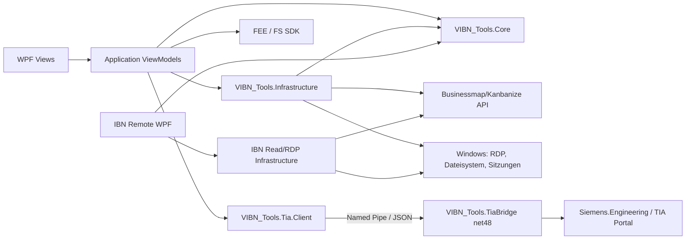
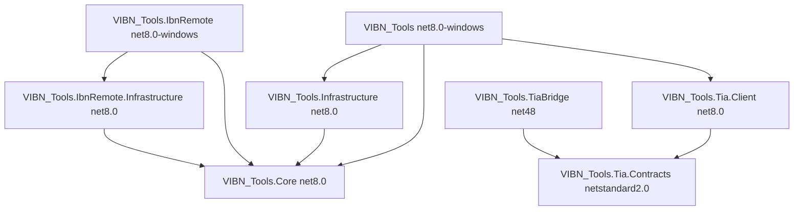
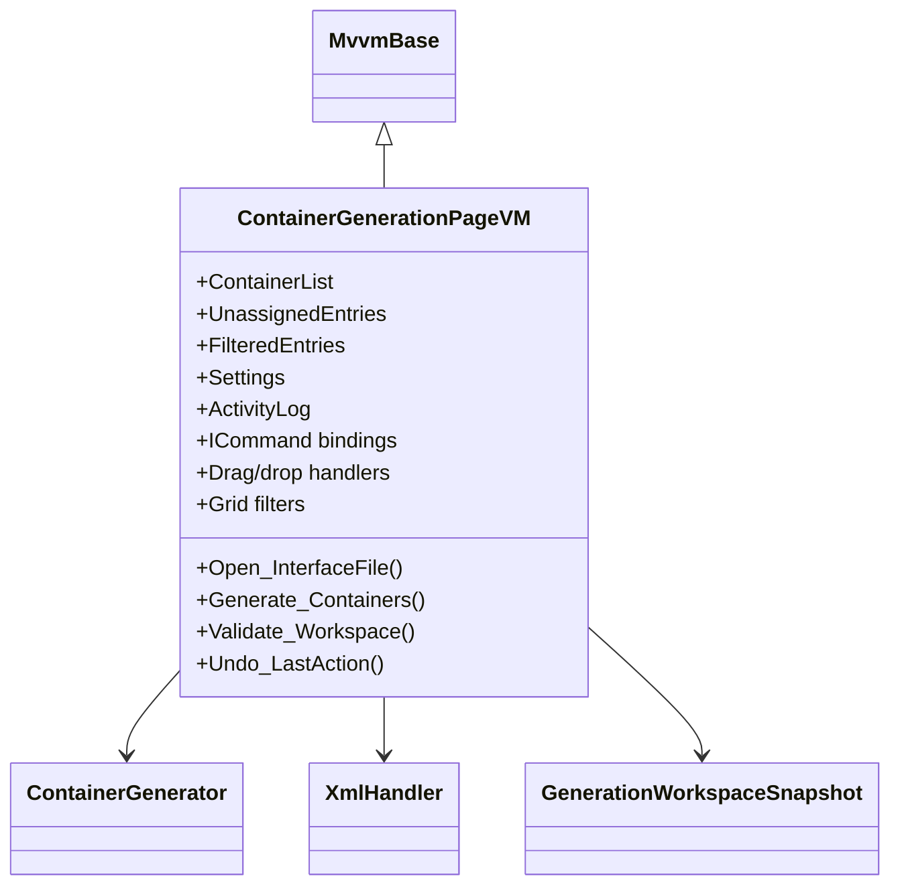
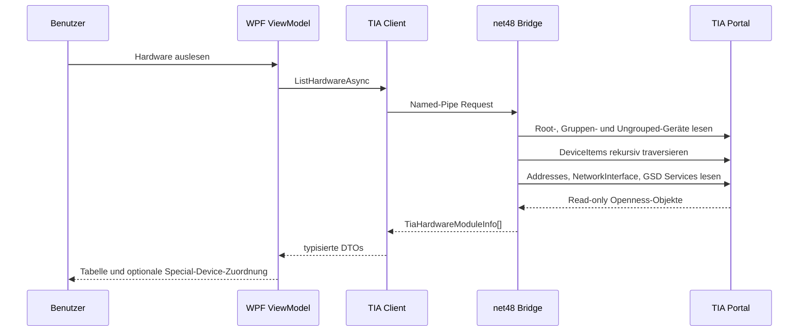
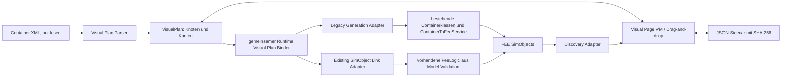
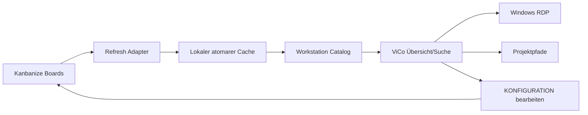

# Architektur- und Datenflussdiagramme

## Komponenten

## Projektabhängigkeiten

## Container-Generator-Klassen

Die große ViewModel-Klasse ist eine bewusst dokumentierte Übergangsausnahme: Eine frühere Aufteilung wurde wegen einer ZULI-Regression zurückgenommen. `Interface5.xlsx` und `Interface7.xlsx` sichern inzwischen Import und Generatorübergabe; vor einer erneuten Zerlegung wird zusätzlich ein Golden Master aus Requirements und erwarteter vollständiger Ausgabe benötigt.

## TIA-Hardwaredatenfluss

## Container2FEE-Visual-Datenfluss

Der gemeinsame Binder überträgt nur typgeprüfte SimObject-Zuordnungen, Erzeugungswünsche und die Auswahl vollständiger Container. Signal-/Slot-Kanten sind sichtbar, bleiben aber Eigentum des bestehenden Executors. Link-only erzeugt keine neuen Modellobjekte.

## ViCo/Kanbanize-Datenfluss

