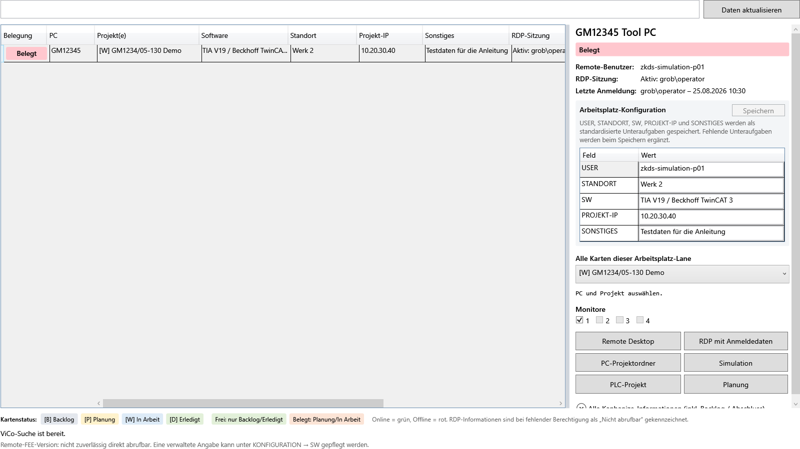
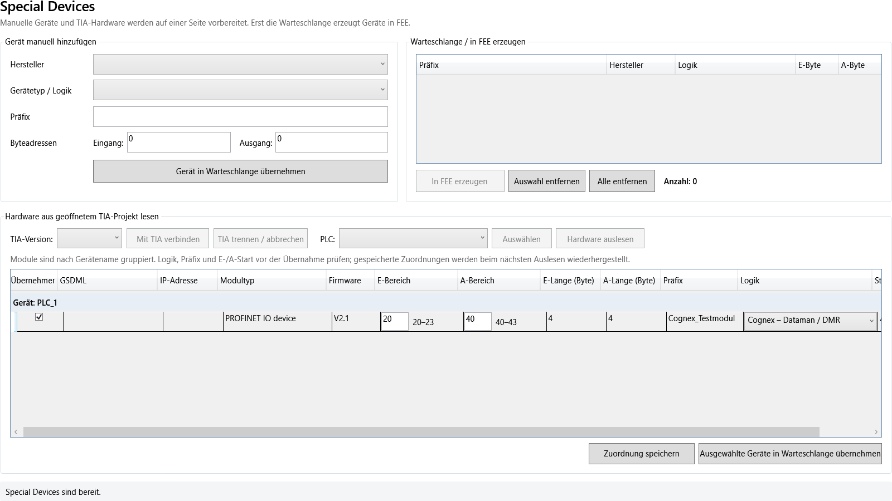

# Benutzerhandbuch

## Zweck und Grundprinzip

VIBN Tools bündelt vorhandene Werkzeuge für Modellierung, FEE und virtuelle Inbetriebnahme mit ViCo, Kanbanize und TIA Portal. Die bisherigen VIBN-Reiter bleiben eigenständige Funktionsbereiche. ViCo ergänzt sie um einen zentralen Blick auf Arbeitsplätze, Projekte, Remote-Zugriff und Arbeitsvorbereitung.

Die Anwendung arbeitet defensiv: externe Aktionen werden erst nach einer bewussten Schaltfläche ausgeführt, Offline-PCs erhalten keine Remote-/Pfadaktionen und Fehler erscheinen in der Statuszeile sowie im Diagnoseprotokoll.

## Reiterübersicht

| Reiter | Zweck | Mindestrolle |
| --- | --- | --- |
| Project Settings | Online-FEE-PC wählen, Verbindung prüfen, Projektbasis anlegen | alle |
| Kanbanize Karten | VIBN-Karten ins Arbeitsplätze-Board synchronisieren; eigene Karten erstellen | Level8 |
| Rechnerübersicht | PC-/Projektsuche sowie Projekte und Favoriten | alle |
| Transfer | Dateien und Ordner zwischen Projektpfaden übertragen | alle |
| TIA Portal | PLC-, Bibliotheks- und Achsenfunktionen über die isolierte TIA-Bridge | alle |
| Administration | Rollen, Termine und verfügbare Versionen verwalten | Level9 |
| CAD Wizard | Joints, Sensoren, Templates und CAD-Hilfen | Level7 |
| Zuli Converter | Zuli-Datei einlesen und Interface-Datei erzeugen | alle |
| Container Generation | Container aus Interface- und Requirements-Dateien prüfen und generieren | Level7 |
| Container2Fee | Container XML mit FEE-Simulationsobjekten verbinden | Level7 |
| Container2FEE Visual | zusätzliche Planansicht mit Drag-and-drop; nutzt denselben Generator | Level9 |
| FEE2Container | exportiert ContainerFiles aus auswählbaren BasicFrames; exakt per Provenienz oder geprüft aus bestehender FEE-Struktur rekonstruiert | Level9 + FEE-Verbindung |
| AI-Test / Regelvorschläge | analysiert protokollierte Slotkorrekturen; geprüfte exakte Regeln mit Vorschau und Backup übernehmen | Level9 |
| SpecialDevices2FEE | Geräte manuell oder aus TIA-Hardware vorbereiten und in FEE erzeugen | alle |
| FEE2SpecialDevices | künftig erzeugte Special Devices über Provenienz aus FEE als JSON rücklesen | Level9 |
| Model Validation | Modell-/FEE-Daten prüfen | alle |
| Model Control | Roboter, Achsen, Objekte und Simulation steuern | alle |
| Interface Operation | Schnittstellen und Signale laden, verbinden und bearbeiten | alle |
| AI-Test | Trainings-/Testbereich | Level9 |
| Project Quality | Projektprofile, Quality Gate, Signalregister, Testszenarien und Adapter-/Compile-Nachweise | Level9 |

Die Berechtigungen sind im Detail in der [Rollenverwaltung](ROLLENVERWALTUNG.md) beschrieben.

Mit **Navigation einklappen** im Kopfbereich wird die linke Navigation auf eine schmale Symbolleiste reduziert; Symbole und ausgewählter Arbeitsbereich bleiben erhalten. **Alt+N** schaltet denselben Zustand um. Die Auswahl wird im lokalen Benutzerprofil gespeichert und beim nächsten Start wiederhergestellt. Im eingeklappten Zustand nennt ein Tooltip den jeweiligen Bereich.

## Empfohlener Arbeitsablauf

1. In **Project Settings** den gewünschten Online-PC filtern, auswählen und die FEE-Verbindung aufbauen.
2. In **Rechnerübersicht → PC-/Projektsuche** den Arbeitsplatz oder das Projekt suchen und Kanbanize-Daten aktualisieren, falls notwendig.
3. Falls eine Karte benötigt wird, im Hauptreiter **Kanbanize Karten** zuerst die Vorschau ausführen und erst danach bewusst synchronisieren.
4. Für TIA-nahe Schritte den Hauptreiter **TIA Portal** oder den TIA-Hardwarebereich auf der gemeinsamen Seite **SpecialDevices2FEE** verwenden.
5. Änderungen, Fehler und externe Zugriffe am unteren Rand im Diagnoseprotokoll nachvollziehen.
6. Vor Übergabe im Level9-Reiter **Project Quality** das Kundenprofil auswählen, Signalvergleich und Quality Gate ausführen sowie den JSON-/HTML-Bericht exportieren. Live-Grenzen stehen direkt im Reiter und im [Project-Quality-Handbuch](PROJECT_QUALITY_GATE.md).

## Project Settings

Der Bereich **Lokale Automatisierungsinstallationen** befindet sich am unteren Ende der Seite. Er erkennt TIA Portal und die zugehörige Openness-DLL dynamisch sowie erkennbare WinCC-, Siemens-/SIMATIC- und TwinCAT-Komponenten. Gleiche Produkt-/Versionsfunde aus 32-/64-Bit-Registry und Dateisystem werden zu einem Eintrag zusammengeführt; der aussagekräftigste vorhandene Installationspfad wird angezeigt. **Neu erkennen** aktualisiert ausschließlich das lokale Inventar. Installationspfad und Nachweis helfen bei der Diagnose; eine erkannte TIA-Version garantiert noch keine Openness-Berechtigung des angemeldeten Windows-Benutzers. Technische Details stehen in [INSTALLATION_DISCOVERY.md](INSTALLATION_DISCOVERY.md).

Das editierbare Dropdown **Online-PC eingeben oder auswählen** ist Auswahl und Filter in einem Feld. Es filtert sofort nach Namen und enthält ausschließlich erreichbare PCs aus dem gemeinsamen ViCo-Arbeitsplatzverzeichnis. Offline-PCs werden absichtlich nicht angeboten.

1. Bei Bedarf **Liste aktualisieren** drücken.
2. PC auswählen; die Statuszeile zeigt anschließend die Erreichbarkeit.
3. **Connect** drücken.
4. Erst nach der technischen Bestätigung zeigt **Connected to** den PC und die Statuszeile meldet „verbunden“.

Der Connect-Button übergibt Server und Zugangsdaten genau einmal an die FEE-SDK. Der weitere Verbindungsaufbau bleibt – wie im ursprünglichen funktionierenden Ablauf – vollständig bei der SDK; die Anwendung trennt einen noch laufenden Versuch nicht nach einem eigenen Timeout. Wirft die SDK den Verbindungsaufruf direkt zurück, bleibt `Connected to: ---` sichtbar und die Fehlerursache steht im Diagnoseprotokoll. **Create Project Base** setzt die bestehende Projektbasisfunktion erst nach einer passenden FEE-Verbindung ein.

Unterhalb der Verbindung stehen verwendete SDK- und lokal installierte FEE-Version. Bei mehreren lokalen Versionsordnern wird nur eine Installation berücksichtigt, in deren eigenem Pfad `Bin\FS.SDK.dll` existiert. Dadurch werden neuere, aber unvollständige Installationsreste nicht mehr als aktive FEE-Version angezeigt. Eine Abweichung zwischen verwendetem SDK und vollständiger lokaler Installation bleibt rot markiert.

Im Bereich **Geschützte Zugangsdaten** werden FEE-Benutzer/-Passwort, API-Key und RDP-Passwort für den aktuellen Windows-Benutzer im Windows Credential Manager hinterlegt. Die verdeckten Eingabefelder übertragen Eingaben in beide Richtungen korrekt. **Eingaben speichern** ändert nur ausgefüllte Passwort-/Key-Felder; die Löschen-Schaltflächen entfernen jeweils nur den zugehörigen Eintrag. Für einen unmittelbaren FEE-Verbindungsversuch werden gerade eingegebener Benutzer und Passwort bereits vor dem Speichern verwendet. Die Statusfelder zeigen lediglich, ob ein Wert vorhanden ist. Die Anwendung übernimmt Änderungen sofort, ohne PowerShell oder Neustart. Ohne konfigurierte oder aktuell eingegebene FEE-Zugangsdaten wird kein Verbindungsversuch gestartet.

Beim Programmstart wird die bewährte gemeinsame FEE-API-Instanz vorbereitet, aber weder eine Verbindung aufgebaut noch eine Interface-Liste abgefragt. Interfaces und Signale werden erst nach bestätigter Verbindung und einem ausdrücklichen Ladebefehl abgefragt. Ein Rechner ohne FEE-Verbindung startet deshalb ohne entsprechende Verbindungs- oder Interface-Fehlermeldung. `localhost` bleibt als lokales Ziel erhalten; die dynamische Online-PC-Liste wird ausschließlich auf dem UI-Thread aktualisiert.

## Rechnerübersicht

### PC-/Projektsuche

Die Unterseite **PC-/Projektsuche** besitzt ein gemeinsames Suchfeld. Mit **Nur angezeigte Spalten durchsuchen** wird die Suche auf die aktuelle Spaltenauswahl begrenzt; ohne Haken werden auch ausgeblendete fachliche Spalten berücksichtigt. Der Zeilen-Tooltip nennt die Spalten, in denen der Treffer gefunden wurde. Mehrere notwendige Begriffe werden mit Komma getrennt (`Motor, Sensor` bedeutet UND). Ein vorangestelltes `!` schließt Treffer aus (`Motor, !Alt, !Sensor`). Die Auswahl wird zusammen mit den sichtbaren Spalten pro Windows-Benutzer gespeichert.

Die Haupttabelle ist auf die Arbeitsplanung reduziert und zeigt in dieser Reihenfolge:

| Spalte | Bedeutung |
| --- | --- |
| Belegung | **Frei** (grün), wenn nur Backlog/Erledigt vorliegt; **Belegt** (rot), sobald Planung oder In Arbeit vorliegt |
| PC | dynamischer Arbeitsplatzname |
| Online | Grün für erreichbar, Rot für offline |
| Planung / In Arbeit | getrennte aktive Kartenlisten; Klick oder Rechtsklick öffnet die konkrete Karte im Browser; beim Arbeitsplatz `Angelegt (Tool)` erscheinen beide Listen wie die Abschlussliste ausklappbar mit Projektanzahl |
| Start Planung / Ende Planung / Start In Arbeit / Ende In Arbeit | ausschließlich die getrennten Datumswerte der jeweiligen Projektkarten; Start aus Custom-Field 508, Ende aus der Karten-Deadline; lässt die Board-Liste die Deadline weg, wird sie gezielt am Kartenendpunkt nachgeladen |
| Abgeschlossene Projekte | ausklappbare Karten der Swimlane **Abgeschlossen** |
| Software | ausschließlich der Wert der Unteraufgabe `SW:` |
| Benutzer | bevorzugter Remote-Benutzer aus der KONFIGURATION-Karte |
| Standort | Wert der Unteraufgabe `STANDORT:` |
| Sonstiges, Projekt-IP | optionale Werte der `KONFIGURATION`-Karte |

Die Statusmarker `[B]`, `[P]`, `[W]` und `[D]` werden in sichtbaren Projektnamen nicht mehr angezeigt. Das Dropdown **Spalten ein-/ausblenden** enthält jede Tabellenspalte als eigene Checkbox und speichert die Auswahl pro Windows-Benutzer. Alle Spalten besitzen eine Sortierung. RDP-Sitzung, letzte Anmeldung und Konfigurationsstatus stehen im Detailbereich. Der ausklappbare Bereich zeigt relevante Projektkarten; Robotik- und KONFIGURATION-Daten bleiben in ihren eigenen strukturierten Detailbereichen und werden dort nicht doppelt dargestellt. Robotik-Metadaten werden nicht als eigene Suchtrefferspalte ausgegeben.

Unter dem Suchfeld zeigt ein Countdown den nächsten automatischen Kanbanize-Abruf. Das Intervall kann zwischen 1 und 1440 Minuten eingetragen und mit **Übernehmen** pro Windows-Benutzer gespeichert werden. Ohne konfigurierten API-Key steht der Zähler auf **pausiert**; sobald der Key in Project Settings gespeichert wurde, beginnt der Countdown ohne Neustart. Beim ersten Öffnen der ViCo-Suche wird bei konfiguriertem Zugriff einmal automatisch derselbe Online-Abruf wie über **Daten aktualisieren** ausgeführt. Dadurch stehen insbesondere nachgeladene Deadlines bereits in der ersten Ansicht zur Verfügung; bei einem Netzwerkfehler bleibt der letzte gültige Cache sichtbar. **Daten aktualisieren** bleibt für eine sofortige manuelle Aktualisierung erhalten und startet den Zähler anschließend neu. Die Kartenliste wird ohne den in dieser Businessmap-Instanz problematischen `fields`-Filter geladen. Fehlen Positionsdaten trotzdem, liest das Tool sie an der einzelnen Karte nach. Ein Stand ohne zuordenbare Arbeitsplatz-Lane und Karte wird mit Zählwerten protokolliert und darf einen vorhandenen gültigen Cache nicht mehr überschreiben.

Wenn Windows die Abfrage einer Remote-Sitzung nicht erlaubt, stehen RDP-Sitzung und letzte Anmeldung im Detailbereich auf **Nicht abrufbar**. Dies ist kein Offline-Status. Bei Start unter einem Konto mit ausreichender Remote-Abfrageberechtigung werden die Informationen normal angezeigt. Die ausgewählte Projektkarte zeigt Start und Ende ohne Uhrzeit; fehlen diese Werte in Kanbanize, erscheint **nicht angegeben**.

### Remote Desktop und Pfade

Nach Auswahl eines PCs stehen bis zu vier lokale Monitore sowie diese Aktionen bereit. Dieselben Aktionen sind über einen Rechtsklick auf die Tabellenzeile verfügbar:

- **Remote Desktop** verwendet den priorisierten Kanbanize-Benutzer. Unmittelbar vor dem Start wird das Kennwort aus dem lokalen Windows Credential Manager temporär für `TERMSRV/<PC>` eingetragen und dieser kurzlebige RDP-Eintrag nach 20 Sekunden entfernt.
- **RDP mit Anmeldedaten** startet dieselbe Remote-Verbindung ohne temporären Eintrag und zeigt bewusst den Windows-Anmeldedialog.
- **PC-Projektordner** öffnet den Pfad auf dem Arbeitsplatz und erfordert deshalb einen Online-PC.
- **Simulation**, **PLC-Projekt** und **Planung** öffnen Serverpfade und bleiben auch bei einem Offline-PC verfügbar, sofern der Pfad aufgelöst werden konnte.

Mehrere Tabellenzeilen können mit Strg/Umschalt markiert werden; RDP- und Pfadaktionen laufen anschließend für alle ausgewählten Arbeitsplätze. Simulation, PLC-Projekt und Planung bleiben deaktiviert, sobald mindestens ein Ziel weder eine Karte in Planung noch in Arbeit besitzt. Ein Klick auf den normal dargestellten Projektnamen – oder **Zur Kanbanize-Karte springen** im Karten-Kontextmenü – öffnet deren konkrete Karten-ID als Kartenansicht auf Board 1541. Dadurch ist zugleich die tatsächliche Swimlane der Karte sichtbar. Die Anwendung übergibt den Link an den Windows-Standardbrowser; ob eine vorhandene Registerkarte wiederverwendet oder eine neue geöffnet wird, bestimmt der Browser. Ein browserübergreifend zuverlässiges Fokussieren einer bestimmten bereits geöffneten Registerkarte ist ohne Browser-Erweiterung beziehungsweise Debug-Schnittstelle nicht möglich.

Das erzeugte RDP-Profil fordert ausschließlich die Ressource **Zwischenablage** an; Drucker, COM-Ports, Smartcards und Laufwerke bleiben aus. Auf aktuellen Windows-Versionen darf eine unsignierte `.rdp`-Datei diese neue Sicherheitsabfrage trotzdem nicht selbst überspringen. Vollständig ohne Zwischendialog funktioniert dies nur mit einer organisationsseitig signierten RDP-Datei und einem per Gruppenrichtlinie vertrauenswürdig hinterlegten Herausgeber; VIBN Tools setzt dafür bewusst keinen Registry- oder Sicherheits-Bypass.

Bei einem Offline-PC bleiben die Aktionen sichtbar: Nur RDP, RDP mit Anmeldedialog und der PC-Projektordner werden mit einem konkreten Tooltip deaktiviert. Die angezeigten Pfade stehen in einem schreibgeschützten Textfeld und können markiert sowie mit **Strg+C** kopiert werden.

Das RDP-Passwort wird einmalig unter **Project Settings → Geschützte Zugangsdaten** geschützt im Windows Credential Manager des angemeldeten Benutzers gespeichert. Es steht weder im Quellcode noch im Kanbanize-Cache oder Rollenbestand. Auf einem weiteren Rechner beziehungsweise in einem anderen Windows-Profil muss es einmalig erneut eingerichtet oder über ein freigegebenes Unternehmens-Secretsystem verteilt werden. Der separate Dialog-Button bleibt für abweichende Zugangsdaten verfügbar.

### Arbeitsplatz-Konfiguration bearbeiten

Die rechte Seite enthält die vorhandenen Unteraufgaben einer Kanbanize-Karte mit dem exakten Titel `KONFIGURATION`:

- `USER:`
- `STANDORT:`
- `SW:`
- `PROJEKT-IP:`
- `SONSTIGES:`

Bei vorhandener Karte Werte bearbeiten und **Speichern** drücken oder im Wertefeld **Enter** betätigen. Enter übernimmt zuerst den aktuellen Text, speichert alle geänderten Standardwerte direkt über die Kanbanize-API und aktualisiert anschließend Tabellenzeile, Benutzerzuordnung und Cache-Projektion. Bestehende Unteraufgaben werden aktualisiert, fehlende Standard-Unteraufgaben werden ergänzt. Fehlt die Karte vollständig, zeigt die letzte Tabellenspalte dies rot an; **Standardkarte anlegen** erzeugt nach ausdrücklicher Bestätigung genau eine `KONFIGURATION`-Karte mit den fünf Standard-Unteraufgaben. Normale Projektkarten bleiben unverändert.

### Projekte & Favoriten

**Projekte & Favoriten** durchsucht Simulationsprojekte, öffnet die Auswahl und verwaltet kompatible ViCo-Favoriten.

## Transfer

Der eigene Hauptreiter **Transfer** kopiert ausgewählte Dateien/Ordner mit begrenzter Parallelität. Diese Begrenzung hält die Desktop-Oberfläche auch bei größeren Übertragungen reaktionsfähig.

## TIA Portal

Projektübersicht und ViCo-Bibliothek stehen auf derselben scrollbaren Seite untereinander. PLC-Auswahl und TIA-Verbindung gelten dadurch ohne Reiterwechsel für beide Bereiche.

1. lokale TIA-Version wählen;
2. **Verbinden** drücken und die gefundene PLC auswählen;
3. **Achsen nur lesen** ermittelt Achsen ausdrücklich ohne Projektänderung und zeigt sie unter **Gefundene Achsen**;
4. Achsen einzeln oder über **Alle**/**Keine** auswählen und **Konfigurieren + AxisDB/AxisFC erzeugen** verwenden; vollständig konfigurierte Achsen wechseln danach in **Konfigurierte Achsen**;
5. Änderungen erst über die dafür vorgesehene Speichern-/Importaktion durchführen.

Die Schaltfläche **Was wird geändert?** blendet die vollständige Wirkung ein. Die Achsenkonfiguration setzt ausschließlich bei den ausgewählten Achsen folgende Parameter und protokolliert jeden tatsächlich gefundenen Schreibzugriff mit Wert und Ergebnis: `_Properties.MotionType`, `Modulo.Enable`, `Actor.DataAdaption`, `Sensor[1].DataAdaption`, `Sensor[1].MountingMode`, `Simulation.Mode`, `Sensor[1].Type`, `TorqueLimiting.PositionBasedMonitorings`, `FollowingError.EnableMonitoring` und `PositionControl.EnableDSC`. X/Y/Z werden nur als getrennte Achskennung oder in Namen wie `AxisX`/`AchseX` als linear erkannt; alle anderen Namen gelten als rotatorisch. Zusätzlich entstehen `AxisDB.xml` und `AxisFC.xml` im gewählten ViCo-Bibliotheksordner. Diese Aktion importiert nicht und speichert das TIA-Projekt nicht automatisch. Fortschrittsbalken und Log zeigen Achse und Einzelergebnisse.

**Gesamtes TIA-Projekt speichern** ruft anschließend `Project.Save()` auf. Dabei werden alle derzeit ungespeicherten Änderungen des geöffneten Projekts dauerhaft geschrieben – auch Änderungen, die außerhalb von VIBN Tools vorgenommen wurden. Der Button wird nur benötigt, wenn die Konfiguration dauerhaft bleiben soll; vor der Betätigung sollte der gesamte Projektstand geprüft werden. Die frühere Ausnahme beim Auswahlsatz wurde beseitigt, indem die Achsenauswahl vor dem dynamischen Openness-Zugriff statisch ausgewertet wird. Der reale Schreib- und Speichervorgang muss dennoch am Zielprojekt mit freigegebenem Openness-Zugriff abgenommen werden.

Die TIA-Bridge läuft separat. Eine fehlende Openness-Berechtigung, eine falsche Version oder ein nicht geöffnetes Projekt führt zu einer Status-/Protokollmeldung, nicht zu einem Absturz der Hauptanwendung.

### ViCo-Bibliothek

Die Schaltfläche **Was wird gemacht?** zeigt diese Anleitung auch direkt im Reiter. Vor Import oder Export muss TIA Portal mit geöffnetem Projekt laufen. In VIBN Tools die passende Version über **Verbinden und öffnen** anbinden, die gewünschte PLC auswählen und **PLC auswählen** drücken.

Bei einem neuen Kundenprojekt wird die ViCo-Bibliothek zuerst manuell in TIA eingefügt. Kundenspezifische Punkte wie RFID und Safetybrücken werden dort bearbeitet. Danach einen Zielordner auf dem Projektlaufwerk des Kundenprojekts und unter **TIA-Bibliotheksordner** den exakten TIA-Ordnernamen angeben. **Bibliothek exportieren** legt dessen Bausteine und Datentypen unter `<Exportordner>/<Name>_<TIA-Version>/_Programm` beziehungsweise `_Datatype` als XML ab. Vorhandene gleichnamige Exportdateien werden ersetzt. Der Export verändert und speichert das TIA-Projekt nicht.

Erst bei einem Folgeprojekt desselben Kunden wird diese Ablage als Importordner gewählt. Fehlende Gruppen werden im ausgewählten PLC-Programm angelegt; gleichnamige Bausteine und Datentypen werden überschrieben. Nach dem Import wird automatisch das gesamte TIA-Projekt gespeichert. Der Import ist daher eine schreibende Aktion und sollte nur gegen einen geprüften Projektstand ausgeführt werden.

Unter **Achsen-Austausch** stehen drei getrennte Buttons zur Verfügung: **TO-Konfiguration exportieren** schreibt alle lesbaren Achsenparameter in `ToConfig`, **TO-Konfiguration importieren** setzt passende Parameter gleichnamiger Achsen, und **Achsen-Schnittstelle erzeugen** schreibt `AxisValueTags.xlsx`. Der Import speichert nicht automatisch. **Was wird gemacht?** nennt Voraussetzungen und Seiteneffekte direkt in der Oberfläche.

Das Auslesen und Zuordnen der Hardware befindet sich ausschließlich unter **SpecialDevices2FEE**. Dadurch gibt es nur noch eine Tabelle und einen eindeutigen Weg bis zur FEE-Warteschlange.

## Administration

Der Hauptreiter ist ausschließlich mit Level9 sichtbar. Level9 kann Benutzer anlegen, entfernen und die Stufe ändern. `lutzma` ist stets Level9 und es müssen immer mindestens zwei verschiedene Level9-Benutzer bestehen. Details: [Rollenverwaltung](ROLLENVERWALTUNG.md).

## Kanbanize Karten

Die VIBN-Synchronisierung berücksichtigt im Quellboard **Virtuelle Inbetriebnahme** ausschließlich Karten aus dem Workflow **Team-Aufgaben** und darin aktive Quellkarten mit **Grundinbetriebnahme** und **Nachpflege**. Karten anderer Workflows werden nicht synchronisiert. Ist der Workflow nicht eindeutig auffindbar, bricht bereits die Vorschau mit einer verständlichen Meldung ab. Zusammengehörige CORE-/CLIENT-/weitere Rollenkarten werden dunkelgrün gruppiert; Konflikte werden nur nach den dokumentierten Quell-ID-, Titel-, Lane-, Termin- und CORE-Regeln gemeldet. Termine erscheinen ohne Uhrzeit. Wenn zu einer bisherigen `*[Gen]*`-Hauptkarte eine Rollenkarte kopiert wurde, kann die Vorschau gezielt nur den Zusatz `CORE` an der Hauptkarte ergänzen. **Planansicht anzeigen** öffnet das Arbeitsplätze-Board im Standardbrowser. Details stehen in [KANBANIZE_KARTEN.md](KANBANIZE_KARTEN.md).

Der Reiter hat zwei bewusst getrennte Arbeitsweisen.

### VIBN → Arbeitsplätze

1. **Boards aktualisieren** und Quell-/Zielboard, Ziel-Lane und Zielspalte auswählen.
2. **Prüfen** drücken. Die Vorschau zeigt Neueinträge, Zeitplanänderungen, unveränderte Karten und Konflikte.
3. Neue Karten sind in **Sync** bereits markiert; Änderungen vorhandener Karten bleiben zunächst unmarkiert. Auswahl einzeln oder über **Alle selektieren** / **Alle deselektieren** prüfen.
4. Erst nach fachlicher Prüfung **Synchronisieren** drücken. Nicht markierte Karten bleiben unverändert.

Für jede zulässige VIBN-Karte mit `Grundinbetriebnahme` gilt:

- Start der Zielkarte = Deadline dieser VIBN-Karte minus 14 Tage.
- Ende/Deadline der Zielkarte = Deadline derselben VIBN-Quellkarte plus 56 Tage.

Die Synchronisierung verwendet die Quellkarten-ID als stabile Ziel-ID und erkennt ältere generierte Karten zusätzlich am eindeutigen Titel. Mehrere passende Zielkarten gelten als Konflikt. Eine separate Vorlagenkarte wird nicht benötigt. Bestehende Zielkarten werden weder verschoben noch umbenannt noch gelöscht; nur Starttermin und Deadline einer eindeutigen generierten Karte dürfen angepasst werden.

Bei der Prüfung zählt nur das lokale Datum. Zwei Zeitwerte am selben Kalendertag gelten als identisch; die Uhrzeit löst kein Update aus.

### Eigene Karte

Im zweiten Unterreiter kann weiterhin freiwillig eine normale Kanbanize-Karte erstellt werden. Arbeitsplätze → Angelegt → Backlog ist die Standardposition; Board, Lane, Spalte, Titel, Beschreibung, Priorität, externe ID und Deadline können weiterhin explizit geändert werden. Diese Funktion ist unabhängig von der VIBN-Synchronisierung.

Weitere Details stehen in [KANBANIZE_KARTEN.md](KANBANIZE_KARTEN.md).

## SpecialDevices2FEE

### Manuelle Geräte

Hersteller, Gerätetyp, Präfix und Byteadressen auswählen. Das Gerät wird zunächst nur in die **Warteschlange** gelegt. Erst **In FEE erzeugen** schreibt es in die verbundene Simulation.

### TIA-Hardware übernehmen

1. Auf der gemeinsamen Seite zum Bereich **Hardware aus geöffnetem TIA-Projekt lesen** wechseln.
2. TIA-Version wählen, **Mit TIA verbinden** und PLC auswählen.
3. **Hardware auslesen** drücken.
4. Die nach Gerätename gruppierte Tabelle zeigt Gerätenamen und Gerätetyp im Gruppenkopf sowie Hardware-ID, GSDML, IP-Adresse, Modultyp, Firmware, E-/A-Bereich, Byte-Längen, Präfix, Logik, Zuordnungsquelle und Status. Die erste Logikzuordnung findet in `TiaHardwareDeviceRowVM` über `SpecialDeviceLogicOption.Suggest` statt. Berücksichtigt werden Gerätename, Gerätetyp, Hersteller, Modulpfad, Typkennung und GSD-Daten; nur eine eindeutige konservative Regel wird vorausgewählt. Die Spalte **Zuordnungsquelle** unterscheidet automatischen Vorschlag, gespeicherte lokale Zuordnung und manuelle Auswahl. Die Diagnosefelder Traversierungsindex, Hierarchietiefe, Modul, Parent, Slot/Subslot, Pfad und Openness-Objektklasse sind aus der Bedienoberfläche entfernt. Kopf-/Interfaceelemente ohne Adresse werden ausgeblendet; ihre Netzwerk-/Firmwaredaten werden an adressführende Kindmodule vererbt. Getrennte PROFIsafe-Module bleiben getrennte Zeilen.
5. Erforderlichenfalls Logik, Präfix und Byteadressen korrigieren. **Keine Logik** ist eine bewusste Auswahl: Die Zeile wird auch mit gesetztem Übernehmen-Haken nicht zur Warteschlange hinzugefügt. Das vorgeschlagene Präfix stammt vom Gerätenamen (Fallback: PROFINET-/Modulname), nicht mehr vom einzelnen Modulnamen.
6. **Zuordnung speichern** legt die geprüften Werte lokal ab und stellt sie beim nächsten Auslesen wieder her.
7. Gewünschte Zeilen markieren und **Ausgewählte Geräte in Warteschlange übernehmen** drücken.
8. In der rechts oben sichtbaren **Warteschlange** kontrollieren und erst danach **In FEE erzeugen** ausführen.

**TIA trennen / abbrechen** bricht auch einen laufenden Attach ab, schließt nur die zu dieser Seite gehörende Bridge-Session und leert PLC-/Hardwareliste. Das geöffnete TIA Portal wird nicht beendet.

Die FEE-Erzeugung ist absichtlich serialisiert und zeigt Gerät, Zähler und Fortschritt. Vor einem Schreibzugriff prüft sie einen exakt gleich benannten Geräte-BasicFrame: Eine gültige SpecialDevices2FEE-Provenienz oder die passende bekannte Gerätelogik gilt als bereits erzeugt; der Eintrag wird dann ohne erneute SDK-Erzeugung aus der Warteschlange entfernt. Fehlgeschlagene oder nicht eindeutig als vollständig erkennbare Geräte bleiben zur Prüfung in der Warteschlange.

Vollständig erzeugte Geräte erhalten am Ende des erfolgreichen FEE-Schreibvorgangs eine versionierte Provenienz am BasicFrame. Teilweise oder fehlerhaft erzeugte Geräte werden nicht als gültige Reverse-Quelle markiert.

## FEE2SpecialDevices

Der eigene Hauptreiter durchsucht alle BasicFrame-Unterebenen. Provenienzmarkierte Geräte werden exakt gelesen; ältere Geräte werden nur bei einer eindeutig bekannten Gerätelogik rekonstruiert und entsprechend als Prüfstand gekennzeichnet. Nach Auswahl können Präfix, Hersteller, Gerätetyp, Startadressen sowie aktuelle und fehlende Signale geprüft und atomar als `*.specialdevice.json` exportiert werden. **SpecialDevices2FEE → FEE2-JSON laden** prüft diese Datei und übernimmt bekannte Geräte über denselben Gerätekatalog in die vorhandene Warteschlange. Bei Signalabweichungen wird gewarnt, weil eine erneute Erzeugung weiterhin die freigegebene Katalogdefinition verwendet. Details und Grenzen stehen in [FEE2SpecialDevices](FEE2SPECIALDEVICES.md).

## Bestehende VIBN-Werkzeuge

### CAD Wizard

Für die gewählte FEE-/Projektvorlage werden Joints, Sensoren und Templates erzeugt; anschließend lassen sich leere Nodes entfernen oder Markierungen in Namen schreiben. Vor einer generierenden Aktion immer die richtige Projektverbindung und Vorlage prüfen.

Ohne bestätigte FEE-Verbindung sind alle FEE-schreibenden Aktionen, Container2Fee-Start, Special-Device-Erzeugung, Model Control, Model Validation sowie Interface-Merge/-Connect deaktiviert. Der Tooltip lautet **Keine Verbindung zu FEE vorhanden.** Project Settings zeigt außerdem verwendete SDK- und lokal installierte FEE-Version; eine Abweichung ist rot markiert.

Auch andere deaktivierte Aktionsbuttons erklären beim Darüberfahren die erste fehlende Voraussetzung, beispielsweise fehlende Eingangsdaten, noch nicht geprüfte Kanbanize-Änderungen, eine fehlende PLC-Auswahl, Level 9 oder einen laufenden Vorgang. Abhängige Eingabefelder – etwa ein Deadline-Feld ohne aktivierte Deadline – sind keine eigenständigen Aktionen.

### Zuli Converter

Zuli-Datei wählen, die angezeigten Optionen prüfen und **Create Interface File** ausführen. Die Statusinformationen zeigen den Fortschritt und die erzeugten Inhalte.

### Container Generation

1. **Open Interface File** wählen und die Zuli-/Interface-Datei laden.
2. **Open Req. XML** wählen und die Requirements-Datei laden.
3. Optional unter **Grouping Settings** die Gruppierung und Ersetzungsregel prüfen.
4. In der Containerliste Filter und Prüfstatus verwenden. Das Dropdown **Prüfstatus** wirkt ausschließlich auf das Hauptfenster mit den Containern. **Unassigned Data** und **Filtered Data** werden davon nicht ausgeblendet und besitzen jeweils nur ihren eigenen Textfilter. Orange oder anders markierte Einträge erfordern eine fachliche Entscheidung.
5. Bei erneut importierten Daten den **Reimport-Vergleich** prüfen, einzelne Änderungen übernehmen oder verwerfen.
6. Erst danach die Generierung starten und Status/Zuordnungen kontrollieren.

**ContainerFile laden** übernimmt ein bestehendes ContainerFile als aktiven sichtbaren Arbeitsstand. Zuvor muss die dazu passende Requirements-XML geladen sein, damit Slots und Typen korrekt validiert werden. **Aktiven Stand vergleichen** ist erst verfügbar, wenn ein solcher oder ein generierter Arbeitsstand existiert, und fragt anschließend genau ein Vergleichs-ContainerFile ab. Der Dialog vergleicht immer den aktiven Arbeitsstand mit diesem Kandidaten und erkennt neue, entfernte und geänderte Signale sowie Container-/Typ-/Slotänderungen. Die gewählte Datei selbst bleibt unverändert; erst **Auswahl anwenden** ersetzt den sichtbaren Arbeitsstand durch das selektiv überlagerte Ergebnis. **Vorschau verwerfen** lässt den aktiven Stand unangetastet. Damit kann ohne aktiven Containerstand kein scheinbarer Zwei-Dateien-Vergleich mehr entstehen.

**Arbeitsstand speichern/laden** verwaltet dagegen den internen, fortsetzbaren Generator-Arbeitsstand (`*.vibn-workspace.xml`, ältere XML-Dateien bleiben lesbar). Diese Funktion ist nicht mit **ContainerFile laden** zu verwechseln.

`Strg+Z` macht die letzte bearbeitbare Aktion rückgängig, `Strg+Y` bzw. `Strg+Umschalt+Z` wiederholt sie.

Vor jedem Container-Export wird der komplette Arbeitsstand validiert. Fehlende Signalnamen/Slots, unzulässige Doppelbelegungen und doppelte Signal-IDs markieren die betroffenen Eingabefelder rot und erscheinen in der Prüfzusammenfassung. Ein regulärer Export ist damit gesperrt. Nur eine ausdrücklich bestätigte Diagnoseausgabe wird trotzdem geschrieben; sie enthält zusätzlich den schema-kompatiblen Container **Fehler** mit allen Hinweisen. Ein leerer `unknown`-Container wird nicht mehr geschrieben.

Die Slotprüfung wird außerdem direkt nach einer Generierung und nach dem Laden einer Requirements-XML auf den vorhandenen Arbeitsstand angewendet. Ein Slot, den die aktive Requirements-Datei für den Containertyp nicht kennt, erhält sofort eine konkrete Warnung mit zulässigen Alternativen. Dies ist insbesondere ein Hinweis darauf, dass Requirements-Datei und Arbeitsstand aus unterschiedlichen Konfigurationsständen stammen können.

Die Referenzdateien `Interface5.xlsx` und `Interface7.xlsx` sind als automatischer Importtest Bestandteil der Solution. Ein Fehler zu `SixLabors.Fonts.FontMetrics.TryGetGlyphMetrics` deutet auf einen gemischten alten Ausgabe-/Installationsordner hin; Anwendung vollständig neu bauen beziehungsweise das neue Setup vollständig installieren.

### Container2Fee

Container XML öffnen, Simulationsobjekte suchen und die vorgeschlagenen FEE-Objekte nacheinander auswählen, erzeugen, überspringen oder abbrechen. Bereits zugeordnete Objekte sind sichtbar markiert. Der abschließende Button startet die Erzeugung erst, wenn die Auswahl vollständig ist.

### Container2FEE Visual

Dieser zusätzliche Reiter verändert den bisherigen Ablauf nicht. Nach **XML öffnen** zeigt er Container, Logiken, Signale, technische Hilfsobjekte, SimObject-Ziele und ihre Verknüpfungen. Die Vorschau funktioniert ohne FEE. Nach einer bestätigten Verbindung lädt **FEE aktualisieren** die vorhandenen SimObjects und ordnet eindeutige Treffer mit gleichem Komponentenname und passendem Typ automatisch zu.

SimObjects können von rechts auf kompatible Ziele gezogen werden. Gefundene FEE-Signale stehen in einer filterbaren virtuellen Liste und können zur bewussten Konfliktauflösung auf einen Signal-Knoten gezogen werden. Für Signal-Knoten lässt sich ein veralteter Slot über eine Dropdownliste auf einen tatsächlich unterstützten Slot korrigieren; der Override wird im Plan gespeichert und ist rückgängig/wiederholbar. Ein Einzelziel wird ersetzt, ein Mehrfachziel ergänzt; ein Objekt kann nur einem Container gehören. Grün bedeutet eindeutig gefunden oder erfolgreich erzeugt, Gelb bedeutet geplante Erzeugung/Vervollständigung, Rot bedeutet fehlend, fehlerhaft oder mehrdeutig. Ein kompletter Container wird nur nach vollständigem Bestandsvergleich beziehungsweise erfolgreicher Erzeugung grün. Fehlende SimObjects sind standardmäßig zur Erzeugung ausgewählt; **Alle/Keine** ändert diese Einstellung gesammelt. Über die Checkboxen in der linken Struktur werden vollständige Container ausgewählt; **Alle selektieren** und **Alle deselektieren** helfen bei großen Plänen. **Alles aufklappen/Alles zuklappen** steuert die kombinierte Container-/Objektstruktur. Einzelne Signale oder Hilfsobjekte können nicht unabhängig deaktiviert werden. Ein Fortschrittsbalken nennt den aktuellen FEE-Schritt und nach Abschluss erscheint eine Fertigmeldung.

**Plan speichern** legt neben der unveränderten XML eine Datei `*.container2fee.visual.json` ab. Sie wird nur wieder angewendet, wenn der Fingerabdruck der XML unverändert ist. Eine separate Auswahl **Signale erzeugen** gibt es nicht mehr: **Start Generation** sucht jedes benötigte Signal in allen vorhandenen Interfaces, verwendet eindeutige Treffer unverändert und erzeugt nur fehlende Signale im eindeutig erkannten **Grob Generation Interface**. Die optionale Interfaceauswahl enthält ausdrücklich **Keins**. Ein fehlendes SimObject blockiert genau dann, wenn sein Container ausgewählt, kein Objekt zugeordnet und die automatische Erzeugung ausgeschaltet ist; andernfalls ist es ein sichtbarer Hinweis. Deaktivierte FEE-, Start- und Link-Aktionen nennen im Tooltip die erste konkrete fehlende Voraussetzung.

**Nur SimObjects verknüpfen** erzeugt nichts neu und verbindet zugeordnete SimObjects nur mit bereits vorhandenen, gleichnamigen LogicObjects. Eine Interface-Auswahl ist dafür technisch nicht erforderlich, weil dieser Modus keine Signale liest, anlegt oder verändert. Er benötigt aber mindestens eine Zuordnung in einem ausgewählten Container und zuvor vollständig gelesene FEE-Modelldaten über **Model Validation → Update Objects**. Details und Grenzen stehen in [CONTAINER2FEE_VISUAL.md](CONTAINER2FEE_VISUAL.md).

Mehrere Signale dürfen denselben `PLC_IN_`-Slot belegen; Container2FEE verbindet dann jedes Signal über ein eigenes Move-Objekt. Doppelte `PLC_OUT_`- oder sonstige Slots werden bereits beim Einlesen mit einer konkreten Fehlermeldung abgewiesen. Eine Best-Effort-Generierung trotz Validierungsfehlern ist nur nach eindringlicher Bestätigung möglich. Der erzeugte Root wird im Namen gekennzeichnet und erhält pro akzeptiertem Fehler einen eigenen Fehler-BasicFrame als Kindobjekt. Bestätigt FEE eine geschriebene `TagComponent`-Property nicht, wird die eigentliche Objekterzeugung nach einem erneuten Schreibversuch fortgesetzt und der Provenienzverlust deutlich protokolliert; FEE2Container kann diesen Root dann möglicherweise nicht automatisch über Provenienz erkennen. Nicht deterministische Signal-/Objektmehrdeutigkeiten bleiben weiterhin gesperrt, bis sie aufgelöst wurden.

Vor **Start Generation** werden außerdem die aus der ModelValidation ableitbaren Pflichtsignale und SimObject-Ziele geprüft. Beim Stopper aktiviert das Tool den `CollisionSlot`, verbindet ihn mit `SIM_Collision` und liest Eigenschaft und Verbindung aus FEE zurück. Auch alle anderen Generatorverknüpfungen werden zurückgelesen; eine fehlende SDK-Bestätigung ist ein Fehler. Neu erzeugte SimObjects behalten die Größen des bisherigen Container2FEE-Generators. Reale Positionen, Pick-/Drop-Marks und die BeltControl-Achsbeziehung bleiben fachlich einzustellen und anschließend über **Model Validation → Update Objects** zu prüfen.

### FEE2Container

Der Reiter liest nach einer FEE-Verbindung nur `BasicFrame`-Roots der obersten Hierarchieebene und lässt den gewünschten Hauptknoten auswählen. Bei gültiger Container2FEE-Provenienz werden Signalname, Adresse/Pfad, Datentyp und Signal-ID über die Variablen-GUID aus dem aktuellen FEE-Stand übernommen. Bei älteren oder manuell aufgebauten Roots werden ausschließlich unterstützte Containerobjekte innerhalb des gewählten Teilbaums sowie ihre eindeutigen Signal-/Slotzuordnungen rekonstruiert. Ein erkannter Container ohne Signalverknüpfung bleibt mit einem schema-konformen `FEE-UNASSIGNED-*`-Prüfeintrag sichtbar, statt verloren zu gehen. Fachlich nicht mehr unterscheidbare Typen und nicht abbildbare Objekte erscheinen als Prüfhinweise. Das exportierte ContainerFile kann anschließend in den bestehenden Containervergleich geladen werden. Details, Grenzen und der ehrliche Live-Abnahmestatus stehen in [FEE2CONTAINER.md](FEE2CONTAINER.md).

Neben dem Programmtitel zeigt die Oberfläche die Dateiversion und den Änderungszeitpunkt der aktuell gestarteten Programmdatei. Dadurch ist direkt erkennbar, welcher Build tatsächlich läuft; die Anzeige aktualisiert sich automatisch mit einer neu gebildeten beziehungsweise ausgetauschten Programmdatei.

### AI-Test / Regelvorschläge

Der Unterreiter **Regelvorschläge** wertet strukturierte manuelle Slotkorrekturen aus. Häufigkeit, Zahl unterschiedlicher Fälle und die daraus berechnete Konfidenz bleiben sichtbar. **Annehmen** oder **Ablehnen** speichert zunächst nur den Prüfstatus. **XML-Vorschau** prüft die angenommenen Regeln und zeigt jede Slotänderung; **XML übernehmen** verlangt nochmals eine Bestätigung, prüft zwischenzeitliche Dateiänderungen und legt eine `.vibn-backup`-Sicherung an. Über **Aktionslogs öffnen** gelangen Sie direkt zur JSONL-Datenbasis. Details stehen in [AI_REGELVORSCHLAEGE.md](AI_REGELVORSCHLAEGE.md).

### Model Validation, Model Control und Interface Operation

Diese Reiter arbeiten auf dem aktuell verbundenen FEE-Modell. Model Validation aktualisiert und prüft Daten; Statuszeile und Log nennen Objektzahl und Dauer. Die Interfacevariablen werden bei **Update Objects** nur einmal als Gesamtsnapshot aus dem SDK gelesen und anschließend pro Interface gruppiert. Model Control steuert die jeweils ausgewählten Robotik-/Achsen-/Objektfunktionen; Interface Operation lädt und verbindet Schnittstellen und Signale. Vor schreibenden Aktionen immer das Zielmodell und die Auswahl in der Statusanzeige kontrollieren.

## Separate IBN-Remote-Ausgabe

Für Inbetriebnehmer steht `VIBN_Tools_IBN.exe` bereit. Die read-only Ansicht enthält PC, Online, In-Arbeit-Projekt, dessen Enddatum, Standort, Sonstiges und Software sowie Monitorauswahl und automatischen RDP-Start. API-Key und RDP-Passwort sind in diesem Teststand als absichtlich ungültige, auslesbare Platzhalter eingebettet und nicht über die Oberfläche änderbar. FEE, TIA, Kanbanize-Schreibzugriffe und alle Generierungswerkzeuge sind nicht Teil dieses Pakets. Erstellung und Sicherheitsgrenze: [IBN Remote](IBN_REMOTE.md).

## Diagnose und Fehlerbehebung

Das Log-Fenster am unteren Fensterrand sammelt Informationen, Warnungen und Fehler aus Project Settings, ViCo, Kanbanize, TIA und SpecialDevices2FEE. Bei einer Rückfrage bitte Zeitpunkt, Bereich, Statusmeldung und – wenn zulässig – die Fehlerdetails aus dem Protokoll angeben. Keine Kennwörter oder API-Schlüssel in Tickets, Screenshots oder Logs aufnehmen.

Die detaillierte Fehlerliste ist in [KONFIGURATION_UND_BETRIEB.md](KONFIGURATION_UND_BETRIEB.md) enthalten. Die Screenshots dieses Handbuchs verwenden ausschließlich synthetische Testdaten.
